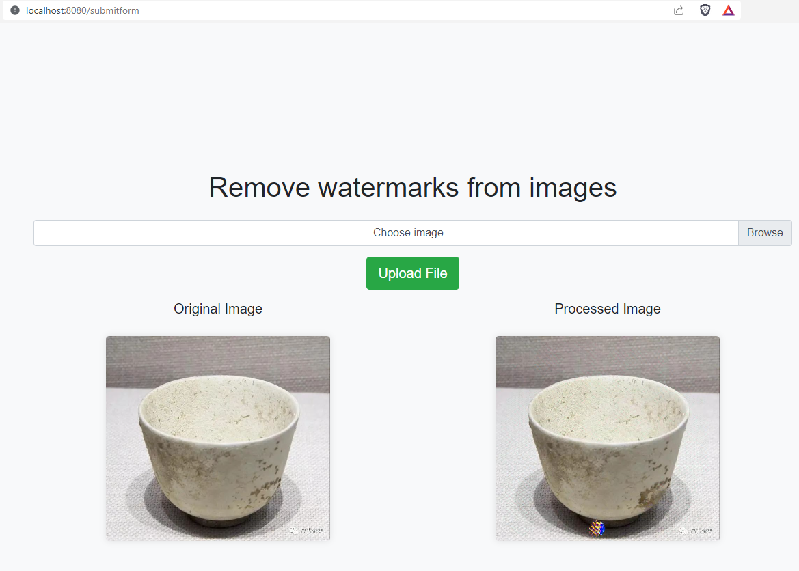

>  This is the application that is forked from [https://github.com/SKondratyeva/watermark_removal_app](https://github.com/SKondratyeva/watermark_removal_app)

To make the dockers run, 

```bash
docker-compose up -d
```

It will outputs like these, and make three containers, e.g. 1. app, 2. worker, 3. redis

```bash
[+] Building 11.1s (17/17) FINISHED                                                     docker:default 
 => [worker internal] load build definition from Dockerfile                                       0.1s 
 => => transferring dockerfile: 411B                                                              0.0s 
 => [worker internal] load .dockerignore                                                          0.0s 
 => => transferring context: 2B                                                                   0.0s 
 => [app internal] load .dockerignore                                                             0.2s 
 => => transferring context: 2B                                                                   0.0s 
 => [app internal] load build definition from Dockerfile                                          0.2s 
 => => transferring dockerfile: 411B                                                              0.0s 
 => [worker internal] load metadata for docker.io/library/python:3.9-slim                         3.5s 
 => [app internal] load build context                                                             0.1s 
 => => transferring context: 1.65kB                                                               0.1s 
 => [worker 1/5] FROM docker.io/library/python:3.9-slim@sha256  0.0s 
 => => transferring context: 168.67MB                                                             7.2s 
 => CACHED [worker 2/5] WORKDIR /app                                                              0.0s 
 => CACHED [app 3/5] COPY ./app/requirements.txt /app/requirements.txt                            0.0s 
 => CACHED [app 4/5] RUN pip install -r /app/requirements.txt                                     0.0s 
 => CACHED [app 5/5] COPY ./app /app                                                              0.0s 
 => [app] exporting to image                                                                      0.0s 
 => => exporting layers                                                                           0.0s 
 => => naming to docker.io/library/watermark_removal_app-app                                      0.0s 
 => CACHED [worker 3/5] COPY ./app/requirements.txt /app/requirements.txt                         0.0s 
 => CACHED [worker 4/5] RUN pip install -r /app/requirements.txt                                  0.0s 
 => CACHED [worker 5/5] COPY ./app /app                                                           0.0s 
 => [worker] exporting to image                                                                   0.0s 
 => => exporting layers                                                                           0.0s 
 => => naming to docker.io/library/watermark_removal_app-worker                                   0.0s 
[+] Running 6/6
 ✔ Volume "watermark_removal_app_redis-data"  Crea...                                             0.0s 
 ✔ Volume "watermark_removal_app_redis-conf"  Crea...                                             0.0s 
 ✔ Container watermark_removal_app-worker-1   Start...                                            0.9s 
 ✔ Container watermark_removal_app-app-1      Started                                             1.0s 
 ✔ Container watermark_removal_app-redis-1    Starte...                                           1.0s
```

Then, it works on web


The output may not be so well on some images...




> Referenced from the [https://github.com/SKondratyeva/watermark_removal_app](https://github.com/SKondratyeva/watermark_removal_app)
>
> How to use:
>
> 1. Go to http://127.0.0.1:8080/home
> 2. Upload a picture in jpeg/png format with a watermark
> 3. Click 'Upload File'
> 4. The service will process your image and return back another image where lighter pixels are supposed to show the place of the watermark.
> 5. The name of the image will be recorded to the database


For what I modified?

A: The original repo has duplicated model dirs, which makes the docker build throw errors. now it is fixed

Modified if you want to build yourself the app dockers,

```bash
docker build -t watermark-remove-app .
```

Building

```bash
[+] Building 11.3s (10/10) FINISHED                                                                                                                                                                                docker:default
 => [internal] load .dockerignore                                                                                                                                                                                            0.2s
 => => transferring context: 2B                                                                                                                                                                                              0.0s
 => [internal] load build definition from Dockerfile                                                                                                                                                                         0.2s
 => => transferring dockerfile: 411B                                                                                                                                                                                         0.0s
 => [internal] load metadata for docker.io/library/python:3.9-slim                                                                                                                                                           3.9s
 => [internal] load build context                                                                                                                                                                                            6.9s
 => => transferring context: 168.67MB                                                                                                                                                                                        6.8s 
 => [1/5] FROM docker.io/library/python:3.9-slim@
 => CACHED [2/5] WORKDIR /app                                                                                                                                                                                                0.0s
 => CACHED [3/5] COPY ./app/requirements.txt /app/requirements.txt                                                                                                                                                           0.0s 
 => CACHED [4/5] RUN pip install -r /app/requirements.txt                                                                                                                                                                    0.0s 
 => CACHED [5/5] COPY ./app /app                                                                                                                                                                                             0.0s 
 => exporting to image                                                                                                                                                                                                       0.0s 
 => => exporting layers                                                                                                                                                                                                      0.0s 
 => => naming to docker.io/library/wm   
```

Run the web app docker indepedently

```bash
docker run -p 8888:8888 watermark-remove-app
```

# TODOLIST

1. [ ] Workder automatically exited issue
2. [ ] Update to Python 3.12
